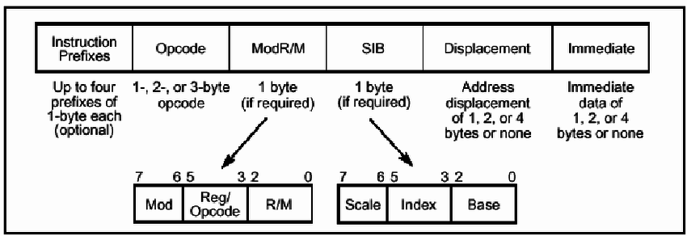
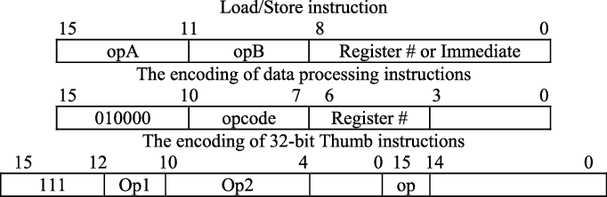

# Codificacion de Instrucciones (Intel 32 bits, ARM M4) 
 Investigar como codifica intel su conjunto de instrucciones de 32bits, así como para un procesador ARM M4.

---

**Intel 32-bit (IA-32)**

- *Prefijos de Instrucción*: Hasta 4 bytes (32 bits), opcionales.
- *Opcode*: De 1 a 3 bytes (8 a 24 bits).
- *Mod*: 2 bits
- *Reg/ Opcode*: 3 bits. 
- *R/M field*: 3 bits. 
- *SIB*: 1 byte (8 bits), opcional, usado para escalado de índice y base.
- *Desplazamiento*: De 1 a 4 bytes (8 a 32 bits)
- *Inmediato*: De 1 a 4 bytes (8 a 32 bits)

- *Prefijos de Instrucción*: Los prefijos de instrucción son de 4 tipos y cada tipo tiene un propósito específico.
- *Opcode*: El código de operación especifica la operación que debe realizarse.
- *ModR/M*: Especifica un registro como operando o como extensión de código de operación como se menciona en la sección de código de operación.
- *Reg/ Opcode:* Especifica un registro como operando o como extensión de código de operación como se menciona en la sección de código de operación.
- *R/M field*: Especifica un operando, ya sea un registro o una memoria.
- *SIB*: Modo de direccionamiento indexado escalado
- *Desplazamiento:* El desplazamiento es la distancia que tenemos que mover el puntero para obtener el valor de los datos de la dirección de memoria mencionada en el byte ModR/M.
- *Inmediato:* Usado para valores constantes

* Las instrucciones de Intel 32-bit tienen una *longitud variable*, lo que significa que no todas las instrucciones ocuparán 32 bits. Algunas instrucciones pueden ser tan cortas como 1 byte (8 bits) y otras pueden extenderse hasta 15 bytes (120 bits).

* La longitud de la instrucción se determina por varios componentes, como prefijos de instrucción, opcode, ModR/M, SIB, desplazamiento e inmediato. Estos componentes pueden variar en tamaño y no todos son requeridos en cada instrucción.

*ARM M4 (ARMv7-M)*

- *Instrucciones Thumb*: Mayormente 16 bits (2 bytes), algunas extendidas a 32 bits (4 bytes).
- *Campos de Operación*: Varían según la instrucción, pero típicamente incluyen:
  - *Opcode*: Generalmente 6 a 11 bits.
  - *Operandos*: Registros o valores inmediatos, el tamaño varía.
  - *Condición*: 4 bits para instrucciones condicionales.

-ARM tiene 37 registros en total. 

1) 1 dedicado al contador del programa 
2) 1 dedicado al status de registro del programa en curso 
3) 5 dedicados a guardar el estatus de los registros 
4) 30 registros de proposito general

- En el caso de ARM M4, las instrucciones son de *longitud fija* en el conjunto de instrucciones Thumb, siendo la mayoría de 16 bits (2 bytes), aunque algunas instrucciones se extienden a 32 bits (4 bytes).
- Para las instrucciones de 32 bits, los bits se dividen entre varios campos como opcode, operandos y condición, pero la suma total de bits no excede de 32.

  ### Fuentes 
1) [An Introduction to Intel 32-bit Instruction Decoding - Medium](https://medium.com/@g.c.dassanayake/an-introduction-to-intel-32-bit-instruction-decoding-9b3b0c15bebb)
2) [Documentation – Arm Developer](https://developer.arm.com/documentation/ddi0439/b/Programmers-Model/Instruction-set-summary/Cortex-M4-instructions?lang=en)
3) [A Beginners' Guide to x86-64 Instruction Encoding - SysTutorials](https://www.systutorials.com/beginners-guide-x86-64-instruction-encoding/)
4) [Assembly instruction length of 32-bit program - Stack Overflow](https://stackoverflow.com/questions/60100987/assembly-instruction-length-of-32-bit-program)
5) [A Tiny Guide to Programming in 32-bit x86 Assembly Language](https://cs.dartmouth.edu/~sergey/cs258/tiny-guide-to-x86-assembly.pdf)
6) [x86 instruction listings - Wikipedia](https://en.wikipedia.org/wiki/X86_instruction_listings)
7) [Documentation – Arm Developer](https://developer.arm.com/documentation/ddi0406/cb/Application-Level-Architecture/ARM-Instruction-Set-Encoding)
8) [Documentation – Arm Developer](https://developer.arm.com/documentation/ddi0406/c/Application-Level-Architecture/Instruction-Details/Format-of-instruction-descriptions/Instruction-encodings?lang=en)
9) [Which instruction encoding is supported by a ARM processor ....](https://stackoverflow.com/questions/77572488/which-instruction-encoding-is-supported-by-a-arm-processor-particularly-a-corte)
10) [The ARM Instruction Set - University of Texas at Austin](https://users.ece.utexas.edu/~valvano/EE345M/Arm_EE382N_4.pdf)