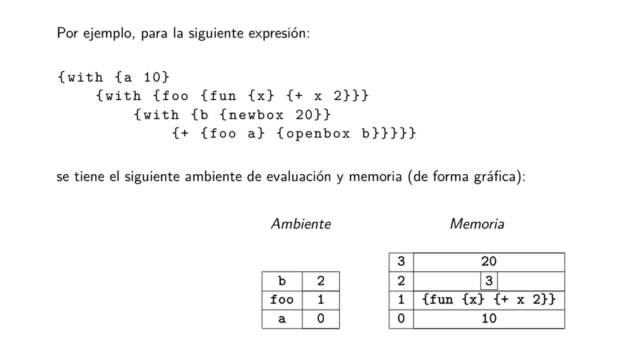

# Stack de un procesador

Describa que es y para que sirve el stack de un procesador.
---

El stack de un procesador es una memoria de acceso rápido que sigue una política de acceso LIFO (Last In, First Out). Su dirección de crecimiento es generalmente hacia direcciones de memoria más bajas (aunque hay algunas arquitecturas donde crece hacia direcciones más altas) y sus operaciones principales son push y pop, que sirven para insertar un dato al tope del stack y para sacar el dato al tope del stack, respectivamente.

También existe un registro de stack, o stack pointer que mantiene la dirección del tope del stack en la memoria del procesador y se actualiza automáticamente con cada operación de push y pop.

La importancia del stack del procesador reside en su capacidad para gestionar llamadas a funciones, la preservación del contexto, y la evaluación de expresiones y pasaje de datos. Para la primera cosa se almacenan en el stack tanto la dirección de retorno (con tal de saber a qué punto de la ejecución regresar después de finalizar la función), como los parámetros reales y variables locales de la función. Para la segunda cosa, se almacenan tanto el estado actual del procesador (registros y la dirección del programa) para poder restaurar ejecuciones en caso de alguna interrupción, como el contexto de la tarea actual antes de cambiar a otra tarea (para poder sistemas operativos multitarea). Y por último para la tercera cosa el stack puede servir de almacenamiento para expresiones aritméticas y lógicas en sus diferentes estadíos de la evaluación, así como de almacenamiento para los valores correspondientes al pasaje de datos en una función (como el paso por valor o el paso por variable, por ejemplo).

Las pilas tambien se usan en las llamadas recursivas de los lenguajes de programacion, ej. 

